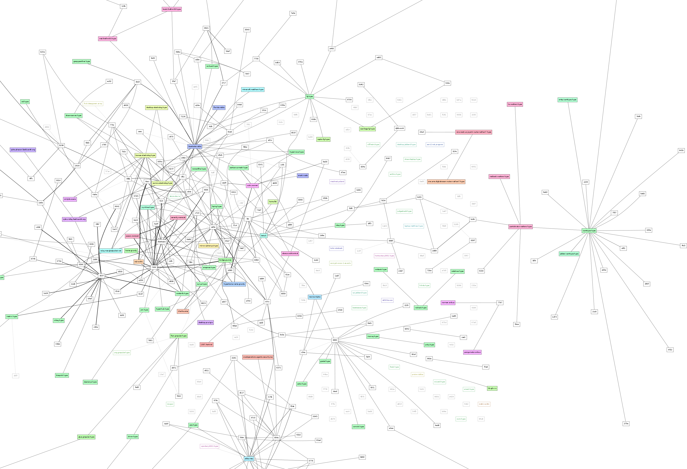

---
#Cjdns

- At the end we will be doing a workshop for getting on Hyperboria
- If you want to start early do this:

```
git clone git://github.com/cjdelisle/cjdns.git
cd cjdns
./do
./cjdroute --genconf >> ~/cjdroute.conf
ed ~/cjdroute.conf

    /* <-- Remove me
     "ETHInterface": [
         ... "bind": "wlan0", <-- This should be wlan0, not eth0
     */  <-- and me
```
<!-- this is needed for the syntax highlighting -->

- Connect your wlan device to the `cjdns` adhoc network
- `sudo ./cjdroute < ~/cjdroute.conf`

---
# Welcome to Hyperboria

- (The cjdns powered network)

---
# Welcome to Hyperboria



---
# Welcome to Hyperboria

- It's just under two years old but has about 600+ nodes

--
- Cjdns has already found commercial applications

--
- Unlike other projects in this space, you don't have to use other applications to communicate

--
- You can use Firefox, you can use Email, you can use IRC

---
# It's just IPv6

--
- But your cjdns IPv6 address is your cryptographic identity, addresses are in the `fc00::/8` private IPv6 block.

--
- It's ok to use HTTP

--
- You can stop buying SSL Certificates

--
- You can use telnet again

--
- You don't need to re-implement transport encryption every time you write an application

---
# What is it not

--
- It's not an overlay network for The Old Internet

--
- To join you need either a wire, a wireless link or a UDP tunnel to an existing node

--
- It is not an anonymity protocol, we are not building another TOR

--
- It is not a file-sharing application, it's not a mail server, it's not a content store

--
- It's just IPv6


---
# Network Neutrality

--
- Making controversial traffic "look innocent" is a losing game

--
- Instead we make all traffic look alike

---
# How can this possibly scale?!

--
- No circuit setup or teardown in the cjdns switch

--
- Packets are switched statelessly allowing for low cost hardware implementations

--
- Routing table is distributed over the network as a Distributed Hash Table

---
# Scalable Source Routing

<center></center>


--
- The algorithm used by cjdns

--
- Believed to scale efficiently to large networks

--
- No more routing loops


<small>http://en.wikipedia.org/wiki/Scalable_Source_Routing</small>


---
# The Enigmabox

--
- A cjdns based commercial offering


--
- Demo


---
# Cjdns Limitations

--
- We've addressed the network and routing but we haven't fully solved the DNS problem.

--
- No deep packet inspection means no way to firewall evil packets

---
# You need to ask for a peer

--
- It is a feature, not a bug

--
- Hyperboria is a network, a community and a web of trust

--
- Leaking Hyperboria to the Internet is like taking pictures at the congress

--


- It's not appreciated

--
- Cjdns *can* auto-peer if the nodes are within wifi range or on the same LAN.


---
# The Future

--
- Today I am announcing a fund for bounties for certain bugs, I'm committing 1 Bitcoin
of my money to the fund and a finder of a qualifying bug can take half of the fund.

--
- How will we make it easier for people to build real networks?

--
- How do we fairly allocate bandwidth resources when you can't tell a Bittorrent packet
from an important email?

--
- Can we effectively make cjdns Post-Quantum?

--
- Ask me later about how we're going to make national firewalls impossible forever

---
# The Future is You

--
- It's just IPv6

---
# Questions?
